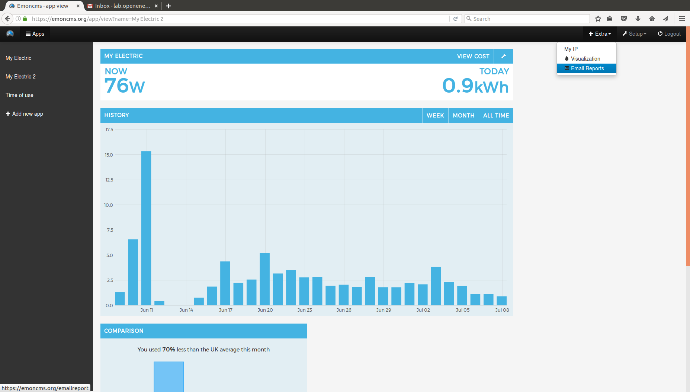
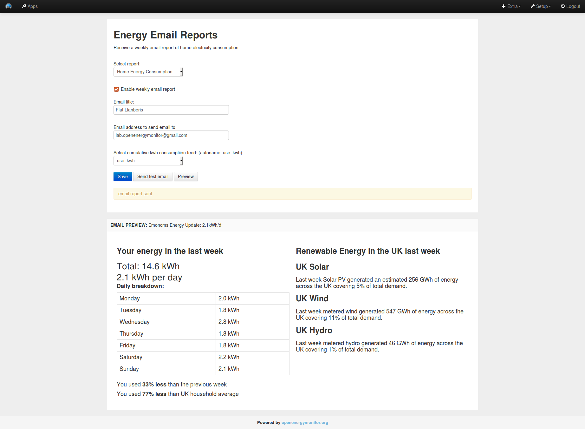
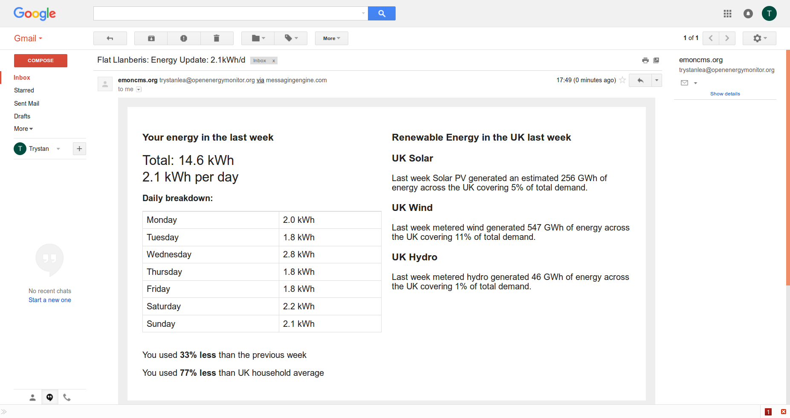

# Email reports

Weekly energy reports delivered to your inbox.

This module can be used to setup a weekly email report of home consumption and solar generation if you are monitoring solar.

The module is currently installed on emoncms.org and can be found under the Extras tab top-right:

In the configuration interface you can enter an email title so that you can differentiate between report emails from different emoncms.org accounts such as a home energy monitor account and a office energy monitor account.

Up to 5 email addresses can be entered for work colleagues, family members, friends.

The email generator needs a cumulative kwh consumption feed (and solar if applicable), the same type of feed as used by the emoncms app module:

Click on 'Send test email' to check that it all works.

The weekly process that runs this at present runs at around 9am on Monday UTC time.

**UK renewable energy**
To make the emails a bit more interesting there is a section on UK renewable energy in the last week which gives a quick overview of how much solar, wind and hydro was generated.

## Setup

Symlink the web part of the emailreport module into emoncms/Modules, if not using Raspberry Pi replace 'pi' with your home folder name:

    ln -s /home/user/emailreport/emailreport-module /var/www/emoncms/Modules/emailreport

Crontab:

    0 9 * * 1 php /home/user/emailreport/weekly-cron.php >> /var/log/emoncms/emailreport.log
