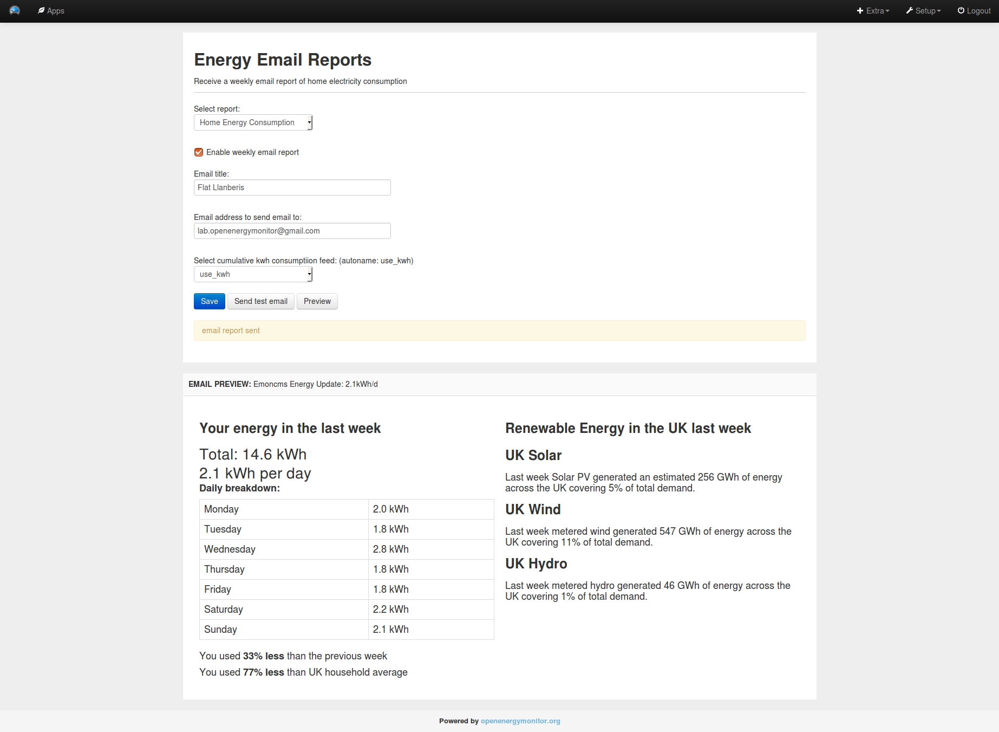
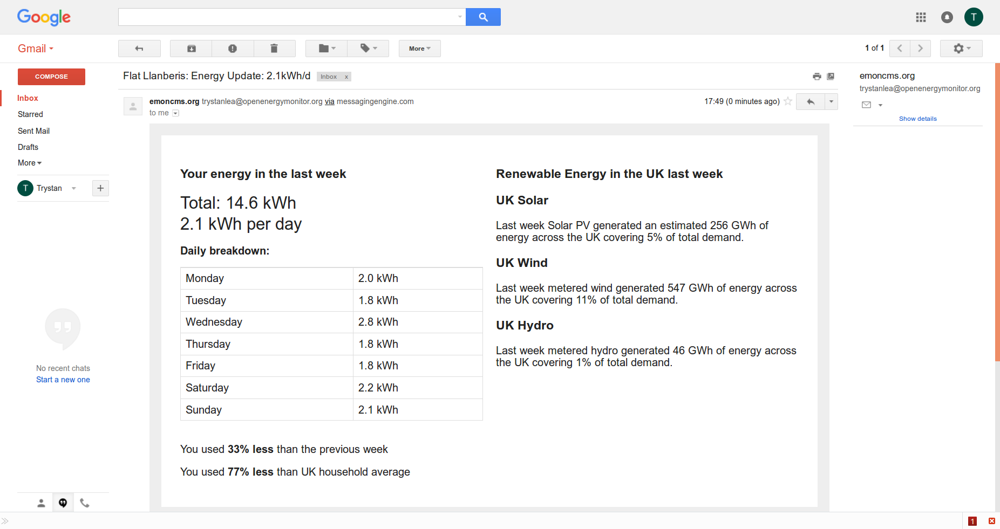

# Email reports

Weekly energy reports delivered to your inbox.

This module can be used to setup a weekly email report of home consumption and solar generation if you are monitoring solar.

In the configuration interface you can enter an email title so that you can differentiate between report emails from different emoncms.org accounts such as a home energy monitor account and a office energy monitor account.

Up to 5 email addresses can be entered for work colleagues, family members, friends.

The email generator needs a cumulative kwh consumption feed (and solar if applicable), the same type of feed as used by the emoncms app module:

Click on 'Send test email' to check that it all works.

The weekly process that runs this at present runs at around 9am on Monday UTC time.

**UK renewable energy**
To make the emails a bit more interesting there is a section on UK renewable energy in the last week which gives a quick overview of how much solar, wind and hydro was generated.

## Setup

Symlink the web part of the emailreport module into emoncms/Modules, if not using Raspberry Pi replace 'pi' with your home folder name:

    ln -s /home/user/emailreport/emailreport-module /var/www/emoncms/Modules/emailreport

Crontab:

    0 9 * * 1 php /home/user/emailreport/weekly-cron.php >> /var/log/emoncms/emailreport.log

## Developer guide: adding a new report type

This module now uses a registry + per-report folder approach.

### Architecture summary

- Report definitions are discovered from `emailreport-module/emails/*/config.php`
- Shared execution helpers are in `emailreport-module/emailreport_runner.php`
- Shared report utilities are in `emailreport-module/emails/common.php`
- Each report type lives in its own folder under `emailreport-module/emails/`

Both `weekly-cron.php` and the web controller call the same generator entry point:

- `emailreport_generate_by_type($report, $config)`

This means adding a new report type should not require editing controller or cron flow logic.

### Step-by-step

1. Create a new report folder

Example for a report key `heat-pump`:

    emailreport-module/emails/heat-pump/report.php
    emailreport-module/emails/heat-pump/template.php

2. Implement a generator function in `report.php`

Use a unique function name, for example:

    function emailreport_generate_heatpump($config) { ... }

Expected return format:

    return array(
        "subject" => "...",
        "message" => "..."
    );

Use `emailreport_view("Modules/emailreport/emails/heat-pump/template.php", $args)` to render HTML.

3. Add `config.php` in the report folder

The registry now auto-loads report definitions by scanning `emailreport-module/emails/`.
Each report folder should include a `config.php` that returns an array.

Example `emailreport-module/emails/heat-pump/config.php`:

    <?php
    return array(
        "key" => "heat-pump",
        "label" => "Heat Pump Summary",
        "generator" => "emailreport_generate_heatpump",
        "config" => array(
            "enable" => array("description" => "Enable weekly email report", "type" => "checkbox"),
            "title" => array("description" => "Email title:", "type" => "text"),
            "email" => array("description" => "Email address to send email to:", "type" => "email"),
            "heat_kwh" => array("description" => "Select cumulative heat kwh feed:", "type" => "feedselect", "autoname" => "heat_kwh")
        )
    );

Notes:

- `include` is optional. If omitted, default is `Modules/emailreport/emails/<folder>/report.php`.
- `key`, `label`, `generator`, and `config` are required.

4. Match config keys with validation + generator expectations

The validation model checks that posted config keys match the schema in the registry.
If your generator expects `heat_kwh`, it must exist in the registry `config` for that report.

5. Verify

- Open the Email Reports page and confirm the new report appears in the selector.
- Save config and run Preview / Send test.
- Run PHP lint for edited files.

### Notes

- Keep runtime files under `emailreport-module/` because that folder is symlinked into `Modules/emailreport`.
- Reuse helper functions in `emailreport-module/emails/common.php` for week-window and UK energy metrics where possible.
- Legacy `emailreport-module/emailreports.php` is now a compatibility proxy to registry config.
